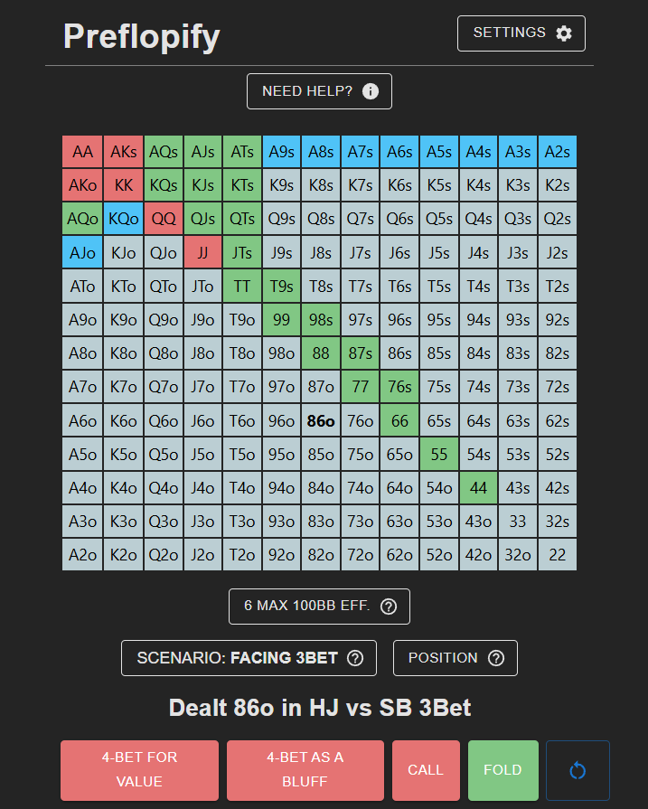

# Preflopify

Poker range trainer built with React + FastAPI. Deployed frontend with AWS Amplify, backend with Amazon EC2 with Security Group Configuration.

To run locally:

`npm run dev`

`cd backend`

`python3 main.py`
